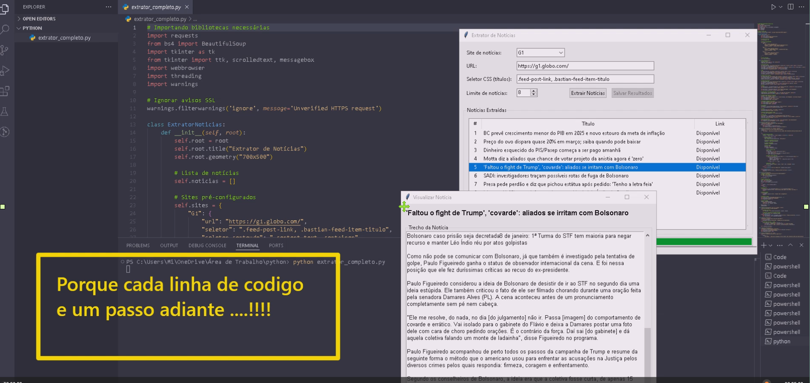

# 📰 Extrator de Notícias 🚀

  
  &nbsp;&nbsp;&nbsp;&nbsp;
  

  
  
  
  
  
  

  
---

## ✨ Sobre o Projeto

O **Extrator de Notícias** é uma aplicação desktop desenvolvida em Python que permite extrair e visualizar notícias de diversos portais brasileiros. Com uma interface gráfica amigável, 
o programa permite que você acesse rapidamente os principais títulos e leia o conteúdo das notícias sem precisar abrir o navegador.

---
## 🔧 Tecnologias Utilizadas

- **Python** - Linguagem de programação principal
- **Tkinter** - Biblioteca para criação da interface gráfica
- **BeautifulSoup** - Para extração de dados HTML (web scraping)
- **Requests** - Para realizar requisições HTTP
- **Threading** - Para processamento paralelo e interface responsiva
  
---
## 🌟 Funcionalidades

- **Extração de múltiplos sites** - Suporte para G1, UOL e Terra
- **Visualização de títulos** - Lista organizada das principais manchetes
- **Leitura de conteúdo** - Acesso ao texto da notícia sem sair do aplicativo
- **Abertura no navegador** - Opção para abrir a notícia completa no seu navegador padrão
- **Interface intuitiva** - Design simples e fácil de usar
  
---
## 📋 Pré-requisitos

- Python 3.7 ou superior
- Bibliotecas: `requests`, `beautifulsoup4`

---
## 🔍 Como Instalar

1. Clone este repositório ou baixe o arquivo do código-fonte:

Instale as dependências necessárias:

bashCopiarpip install requests beautifulsoup4

---
🚀 Como Usar

Execute o arquivo principal:

bashCopiarpython extrator_completo.py

Na interface:
• Selecione o site de notícias desejado no menu dropdown
• Defina o número de notícias que deseja extrair
• Clique em "Extrair Notícias"
• Dê um duplo clique em qualquer notícia para visualizar seu conteúdo

---
📊 Sites Suportados

✅ Funcionando UOLNotícias gerais

✅ Funcionando TerraNotícias gerais

✅ Funcionando G1Notícias gerais

---
## 🔮 Próximos Passos

Adicionar suporte a mais portais de notícias
Implementar filtros por categoria
Adicionar função de pesquisa por palavras-chave
Criar sistema de alertas para tópicos específicos
Desenvolver versão para dispositivos móveis

---
## 🛠️ Personalização
Para adicionar novos sites ao extrator, modifique o dicionário self.sites na classe ExtratorNoticias:
pythonCopiarself.sites = {
    "Nome do Site": {
        "url": "https://www.site.com/", 
        "seletor": ".classe-dos-titulos",
        "seletor_conteudo": ".classe-do-conteudo"
    },
    # Adicione mais sites aqui
}

---
📝 Notas

👥 Agradeço sinceramente a oportunidade de compartilhar este projeto, que, embora simples, representa um marco significativo no meu aprendizado em desenvolvimento web. 
Reconheço que ainda tenho um longo caminho a percorrer e muito a aprender, mas estou comprometido em continuar me dedicando e aprimorando minhas habilidades. Este projeto foi 
desenvolvido para colocar em pratica  o conhecimento adquirido.

👨‍💻 Desenvolvido por [Jose Escudero (um dev em aprendizado!).] 😃

"DEV APRENDIZADO" - Porque cada linha de código é um passo adiante! 🚀

